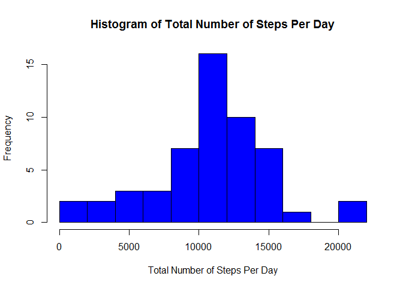
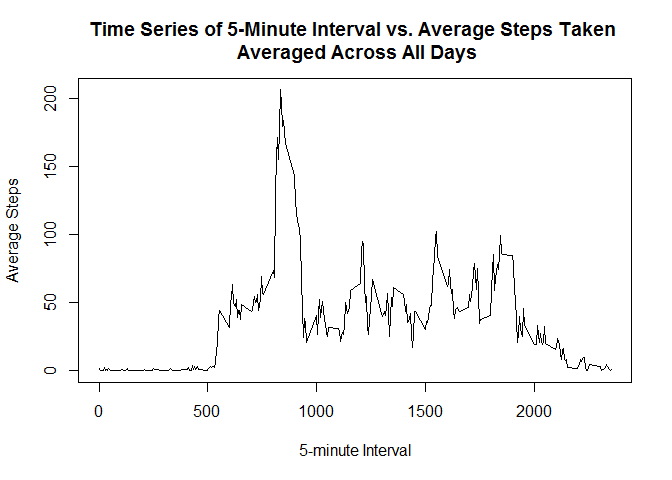
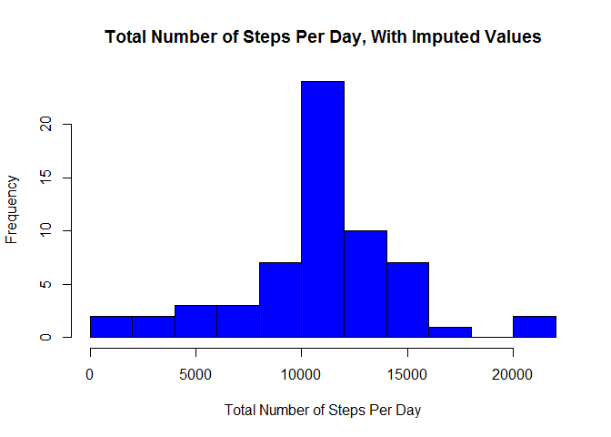
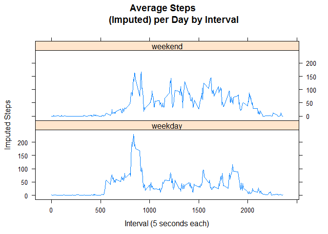

# Reproducible Research: Peer Assessment 1
## Introduction

It is now possible to collect a large amount of data about personal
movement using activity monitoring devices such as a
[Fitbit](http://www.fitbit.com), [Nike
Fuelband](http://www.nike.com/us/en_us/c/nikeplus-fuelband), or
[Jawbone Up](https://jawbone.com/up). These type of devices are part of
the "quantified self" movement -- a group of enthusiasts who take
measurements about themselves regularly to improve their health, to
find patterns in their behavior, or because they are tech geeks. But
these data remain under-utilized both because the raw data are hard to
obtain and there is a lack of statistical methods and software for
processing and interpreting the data.

This assignment makes use of data from a personal activity monitoring
device. This device collects data at 5 minute intervals through out the
day. The data consists of two months of data from an anonymous
individual collected during the months of October and November, 2012
and include the number of steps taken in 5 minute intervals each day.

## Data

The data for this assignment can be downloaded from the course web
site:

* Dataset: [Activity monitoring data](https://d396qusza40orc.cloudfront.net/repdata%2Fdata%2Factivity.zip) [52K]

The variables included in this dataset are:

* **steps**: Number of steps taking in a 5-minute interval (missing
    values are coded as `NA`)

* **date**: The date on which the measurement was taken in YYYY-MM-DD
    format

* **interval**: Identifier for the 5-minute interval in which
    measurement was taken

The dataset is stored in a comma-separated-value (CSV) file and there
are a total of 17,568 observations in this
dataset.

## Loading and preprocessing the data
The first step is to load necessary libraries that will be used throughout the 
assignment.  In this case, `lattice` for some plotting in the last step, and
`plyr` for data manipulation.


```r
library(lattice)
library(plyr)
```

Now, we'll load the appropriate data from the downloaded zip file and we'll
also go ahead and make sure that the `date` column gets loaded as Date format.


```r
mydata <- read.csv(unz("activity.zip", "activity.csv"))
mydata$date <- as.Date(mydata$date)
```

## What is mean total number of steps taken per day?

The next step is to create a variable containing the sum of the steps taken each
day. And from this we can calculate the mean and median of the total steps per
day. 


```r
dailysteps <- ddply(mydata[,1:2], "date", numcolwise(sum))
summary(dailysteps$steps)
```

```
##    Min. 1st Qu.  Median    Mean 3rd Qu.    Max.    NA's 
##      41    8841   10760   10770   13290   21190       8
```

Finally, we'll plot a histogram showing the frequency of the total daily steps.


```r
hist(dailysteps$steps, breaks = 15, xlab = "Total Number of Steps Per Day", 
     main = "Histogram of Total Number of Steps Per Day", col = "blue")
```

\


## What is the average daily activity pattern?

Similar to the above question, now we're going to plot the average steps across 
activity and then we will calculate which interval has the maximum number of 
steps across all of the days.


```r
dailyactivity <- ddply(mydata[,c(1,3)], "interval", numcolwise(mean, na.rm = TRUE))
maxInterval <- dailyactivity[dailyactivity$steps == max(dailyactivity$steps),1]
maxInterval
```

```
## [1] 835
```

Finally, we'll see a time series plot of the 5-minute interval average steps 
across all of the days.


```r
plot(dailyactivity, type = "l", xlab = "5-minute Interval", ylab = "Average Steps", 
     main = "Time Series of 5-Minute Interval vs. Average Steps Taken \n Averaged Across All Days")
```

\


## Imputing missing values

Now it's time to fill in all of those NA's.  First, let's see how many we have:


```r
totalMissing <- sum(is.na(mydata))
totalMissing
```

```
## [1] 2304
```

There are a few options on how to fill in the blanks.  I'm choosing to take the
average steps across all days per interval (as calculated above with the 
`dailyactivity' variable), and fill in the matching intervals for missing values.


```r
## First let's create a logical vector of which rows need to be fixed
na <- is.na(mydata$steps)

## Now, for those blank 'steps' fields in the data frame, fill in the value
## from the corresponding interval in the 'dailyactivity' frame
mydata[na,"steps"] <- dailyactivity$steps[match(dailyactivity$interval,
        mydata$interval)]
```

Now that we have filled in all the NA's, we can re-run the histogram from the 
beginning, this time using the imputed `mydata` data frame.


```r
newdailysteps <- ddply(mydata[,1:2], "date", numcolwise(sum))

hist(newdailysteps$steps, breaks = 15, xlab = "Total Number of Steps Per Day", 
        main = "Total Number of Steps Per Day, With Imputed Values", 
        col = "blue")
```

\

And finally, let's see how the mean and median have changed.


```r
summary(newdailysteps$steps)
```

```
##    Min. 1st Qu.  Median    Mean 3rd Qu.    Max. 
##      41    9819   10770   10770   12810   21190
```

As expected, since mean hasn't changed because the NA's were associated with 
completely empty days, so when we filled up the days with the average values for 
each interval, there was no change.  The median does have a slight shift, 
however, because we are in effect changing the weighting due to adding in more
data points, even if they are all of the same mean.

## Are there differences in activity patterns between weekdays and weekends?

Now we want to see if there are any differences in activity on weekdays versus
weekends. So the first thing we need to do is add a new column to our data
frame that includes whether the day of the week is during the week or on a 
weekend.


```r
## First we add a new variable `week` to the data frame that contains the
## day of the week based on the date
mydata$week <- paste(weekdays(mydata$date))

## Then, using an If/Else statement, we go through and change the value of each
## element in `week` to the corresponding "weekend" or "weekday"
mydata$week <- as.factor(ifelse(mydata$week %in% c("Saturday", "Sunday"), "weekend", "weekday"))
```

Now we have a data frame that contains a column stating whether each record is 
on the weekend or a weekday.  From here, we can re-do our time series plot for
each outcome - weekend or weekday.


```r
weekagg <- aggregate(steps ~ interval + week, mydata, mean)
xyplot(weekagg$steps ~ weekagg$interval | weekagg$week, main ="Average Steps 
        (Imputed) per Day by Interval", xlab ="Interval (5 seconds each)", 
        ylab ="Imputed Steps", layout = c(1,2), type = "l")
```

\
Based on the chart, it looks as though there is a definitely an increase in 
activity over the weekends, which is pretty obvious, since most of the weekdays
we are sitting in front of our computers doing R assignments.
